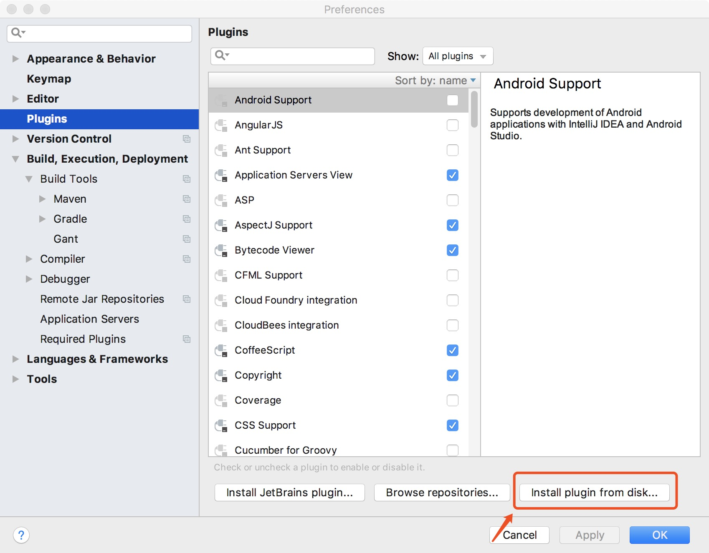
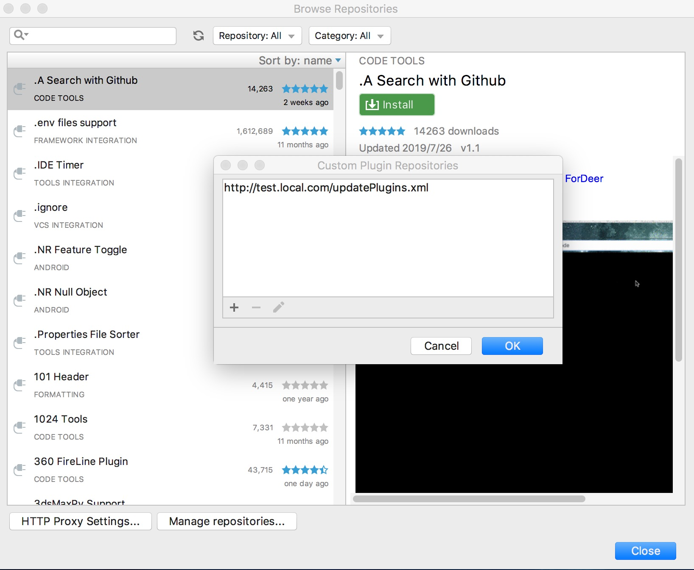
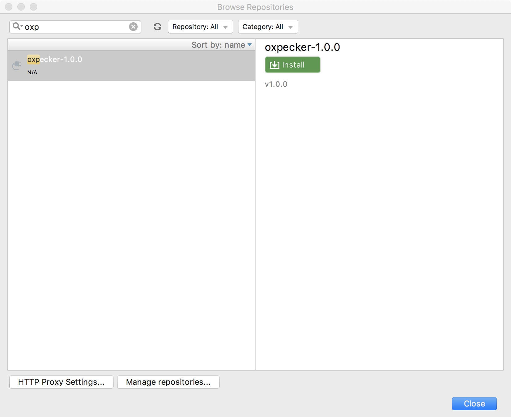
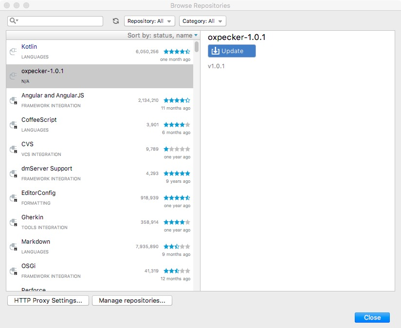

## 关于我们
Website：https://security.immomo.com <br>
WeChat:<br> 
<br>
[文章地址](https://dwz.cn/yIyclLxZ)
<br>
## 项目简介

oxpecker是一款用于提取开发项目仓库地址、当前分支、三方组件等信息用于安全分析的JetBrains家族IDE插件。

---
## 一、准备
- Project JDK: 1.8+
- Gradle: 5.0+（Require JDK1.8+ for gradle）

## 二、构建

在开始构建之前，修改/oxpecker/src/main/java/com/thecastle/idea/until/InformationExtractAndSendUtil.java文件第47、54、104、214行

```java
//修改上传数据加签key
private static final String key = "change_md5_key";

//修改用于探测服务可达的地址，建议与数据提交地址位于相同服务上
String response = HttpRequestUtil.sendGet("http://web.local.com", "");

 //修改为实际数据提交地址
HttpRequestUtil.sendPost("http://web.local.com", param);

//域名修改为内部仓库地址；非该域名的信息将不会上传
 if (!gitAddress.contains("github.com")) {

```
构建
```
cd oxpecker
gradle clean buildPlugin
```

## 三、插件安装
#### 1、本地文件安装
依次选择
```
Preferences >> Plugins >> Install plugin from disk...
```
从./oxpecker/build/libs 选择oxpecker-1.0.0.jar安装，然后重启IDE
<br>
<br>


#### 2、通过私有插件仓库安装
搭建web服务，把updatePlugins.xml 及oxpecker-1.0.0.jar文件放在web目录下，updatePlugins.xml文件内容如下：

```$xml
<?xml version="1.0" encoding="UTF-8"?>
<plugins>
    <plugin id="com.thecastle.oxpecker" url="./oxpecker-1.0.0.jar" version="1.0.0">
         <idea-version since-build="162.1628.40" /> 
    </plugin>
</plugins>

```
然后依次打开：

```
Preferences >> Plugins >> Browse repositories... >> Manage repositories...
```
添加私有仓库地址http://test.local.com/updatePlugins.xml
<br>
<br>

<br>
<br>
查询并进行安装
<br>
<br>

<br>
<br>
插件需要更新时，把新版本插件上传到web目录下，并修改updatePlugins.xml文件内容，IDE即可选择更新
<br>
<br>

